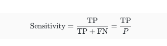
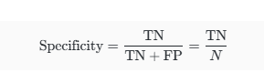

# 머신러닝

## 지도학습(Supervised Learning)

- 입력 데이터(X)와 그에 해당하는 정답 레이블(Y)쌍이 주어진 상태에서, 이 데이터를 통해 통계 모델 f를 학습하여 새로운 입력 값 X'에 대해 정확한 정답 값 Y'을 예측하는 기법

- 특징
    - 입력 데이터(X)와 출력 데이터(Y, 정답) 모두 필요
    - 목표는 X와 Y사이의 관계 함수 f(X)를 학습하는 것
    - 주요 문제유형은 연속값 예측(Regression)과 분류(Classification)

- 응용 분야
    - 연속값 예측(Regression): 주택 가격 예측, 광고비 지출 대비 판매량 예측 등 연속적인 수치를 예측
    - 분류(Classification): 이메일 스팸 여부 분류(스팸/일반), 주식 시장 방향 예측(업/다운) 등 카테고리 또는 질적 값  예측

## 비지도 학습(Unsupervised Learning)

- 출력 레이블(Y) 없이 입력 데이터(X)만 주어졌을 때, 데이터에 내재된 숨겨진 구조, 패턴 또는 관계를 스스로 학습하고 해석하는 기법

- 특징
    - 출력 데이터(Y, 정답 레이블)가 없음
    - 목표는 입력 데이터 X의 내재된 구조를 발견하는것
    - 대표적인 문제 유형은 군집화(Clustering)

- 응용 분야
    - 군집화(Clustering): 유전자 표현 데이터에서 암세포와 관련된 유전자 그룹을 찾는 것
    - 데이터 해석: 고차원 데이터를 저차원으로 축소하여 시각화 및 해석의 용이성을 높이는 것

## 성능 평가 지표: 평균 제곱 오차(Mean Squared Error, MSE)

- 회귀 문제(연속값 예측)에서 모델의 예측 성능을 평가하는 가장 일반적인 지표. 실제 값과 모델의 예측 값 간의 차이(오차)를 제곱한 값들의 평균

- 특징
    - 오차의 크기에 비례하여 페널티를 증가시킴(제곱 사용)
    - 항상 0 이상의 값을 가지며, 값이 작을수록 예측 성능이 우수
    - 단위가 실제 값의 단위의 제곱이 됨

## 학습 데이터와 테스트 데이터의 구분 (Training vs Test data)

- 학습 데이터: 모델을 학습시키는데 사용되는 데이터
- 테스트 데이터: 모델의 실제 성능을 평가하기 위해 사용되는 데이터

- 모델 학습의 궁극적인 목표는 새로운, 이전에 보지 못한 데이터에 대해 정확하게 예측하는 것임. 학습 데이터에 대한 성능(Training MSE)가 아무리 좋아도, 살제 성능(Test MSE)이 낮다면 의미가 없음. 따라서 모델 학습에는 학습 데이터만 사용하고, 학습이 완료된 후 모델의 일반화 능력을 평가하기 위해서는 테스트 데이터를 사용해야 함

- Training error: 학습에 사용된 데이터에 대한 에러
- Test error: 새로운 데이터에 대한 모델의 예측값에 대한 평균 에러
- Training error가 작더라도 Test error는 클 수 있음. 이는 모델이 학습 데이터에 지나치게 맞춰져서(과적합) 일반화 능력이 떨어졌음을 의미

## 과적합(Overfitting)

- 기계 학습 모델이 Training data에 너무 맞춰져서 Training error는 매우 작지만, Test data에 대한 Test error는 오히려 증가하는 현상

- 과적합은 모델의 유연성(Flexibility)이 너무 높아져서, 데이터에 포함된 순수한 패턴뿐만 아니라 데이터의 노이즈까지 패턴으로 인식하고 학습하려고 노력할 때 발생. 마치 시험 범위의 예제를 완벽하게 외웠지만, 새로운 유형의 문제에는 전혀 대처하지 못하는 학생과 같음

- flexibility가 증가함에 따라 Training MSE는 지속적으로 감소하지만, Test MSE는 일정 수준까지 감소하다가 특정 시점 이후에는 증가하는 U자형 곡선을 보임. Test data가 증가하기 시작하는 지점부터 과적합 발생

- 유연성(Flexibility): 모델의 복잡도를 나타냄. 유연성이 높아지면 학습 데이터에 더 잘 맞출 수 있음
- Irreducible error: 데이터 자체에 내재된 줄일 수 없는 오차. 모델이 이 오차까지 패턴으로 인식하려 할 때 과적합이 심화됨

## 분류 문제에서의 평가 지표: 민감도(Sensitivity)와 특이도(Specificity)

- 분류 문제에서 모델의 성능을 평가하기 위해 사용되는 지표. 특히 불균형 데이터셋이나 특정 클래스의 예측이 중요할 때 사용

- 민감도(Sensitivity): 실제 긍정 클래스 중 모델이 정확하게 긍정으로 분류한 비율

- 특이도(Specificity): 실제 부정 클래스 중 모델이 정확하게 부정으로 분류한 비율

- 응용 분야: 의료 분야(질병 진단), 금융 분야(사기 거래 탐지, 신용 불량 예측)등에서 한쪽 오류(FP, FN)가 심각한 결과를 초래할 때 중요하게 사용